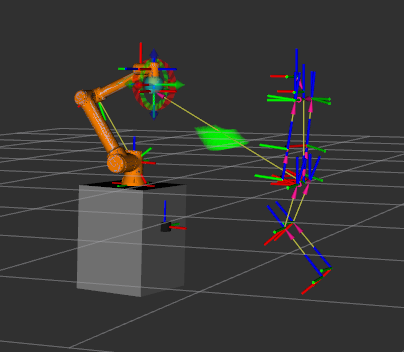
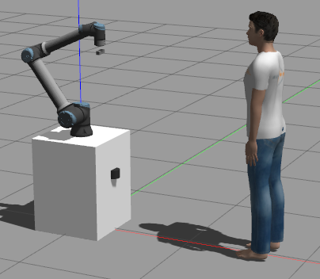

# Testing in Simulation
To test this package in a simulated UR10e environment—which includes the integrated camera and LiDAR sensor—we have developed a dedicated simulation environment featuring a UR10e manipulator and a human model.

You can access the simulation repository here:
**[UR10e Simulation Repository](https://github.com/nikolaslps/ur_gazebo_sim)**

## Quick Start
1. **Setup Simulation**: Clone the repository above and follow the instructions in its `README.md` to launch the environment.

2. **Testing Modules**: To test the `kiro_handover_calculation` module, please follow the specific instructions in our [Docker Documentation](../docker/Docker-Install.md).

> [!NOTE]
> The only difference when launching the simulation is the specific launch parameters here:
> ```bash
> ros2 launch kiro_handover_calculation kiro_handover_calculation.launch.py \
>    image_compressed:=false \
>    planning_frame:=base_link \
>    color_img_topic:=/camera/image_raw \
>    depth_img_topic:=/camera/depth/image_raw \
>    color_info_topic:=/camera/camera_info \
>    depth_info_topic:=/camera/depth/camera_info
> ```

> [!IMPORTANT]
> Remember to trigger the handover nodes to start using the following service:
> ```bash
> ros2 service call /activate_handover_calc kiro_handover_interfaces/srv/ActivateHandover "{handover_phase: true}"
> ```


## Verification
You can verify successful launch and usage by echoing to the following publish topic:

```text
root@Nitro-ANV16-61:~/hri_calc_ws# ros2 topic echo /humans/bodies/betxf/handover_volume --once
markers:
- header:
    stamp:
      sec: 1781715028
      nanosec: 849117981
    frame_id: body_betxf
  ns: handover_volume
  id: 0
  type: 8
  action: 0
  pose:
    position:
      x: 0.0
      y: 0.0
      z: 0.0
    orientation:
      x: 0.0
      y: 0.0
      z: 0.0
      w: 1.0
  scale:
    x: 0.015
    y: 0.015
    z: 0.0
  color:
    r: 0.0
    g: 1.0
    b: 0.0
    a: 0.4000000059604645
  lifetime:
    sec: 0
    nanosec: 0
  frame_locked: false
  points:
  - x: 0.7770000000000001
    y: 0.17600000000000002
    z: 0.38849364905389033
  - '...'
  colors: []
  texture_resource: ''
  texture:
    header:
      stamp:
        sec: 0
        nanosec: 0
      frame_id: ''
    format: ''
    data: []
  uv_coordinates: []
  text: ''
  mesh_resource: ''
  mesh_file:
    filename: ''
    data: []
  mesh_use_embedded_materials: false
---
```

## System Visualization
<table>
  <tr>
    <td></td>
    <td></td>
  </tr>
  <tr>
    <td align="center"><b>Figure 1:</b> RViz Visualization (Skeleton & Handover Volume)</td>
    <td align="center"><b>Figure 2:</b> Gazebo Simulation Environment</td>
  </tr>
</table>

> [!NOTE]
> **Visualization:** In order for the optimal handover volume (green color in the above figure) to be visualized, the fixed frame in RViz must be set to the corresponding/tracked human <body_id> (e.g. for the above terminal example to: body_betxf).