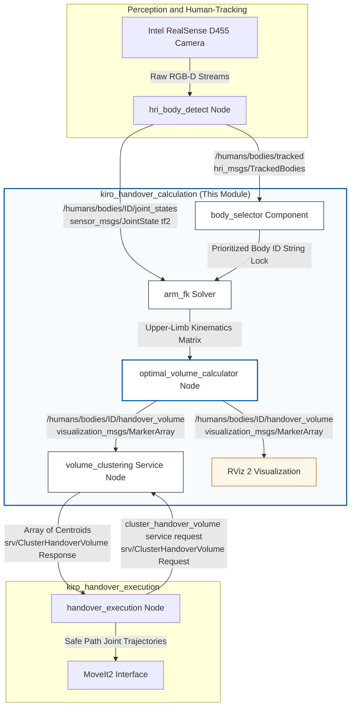
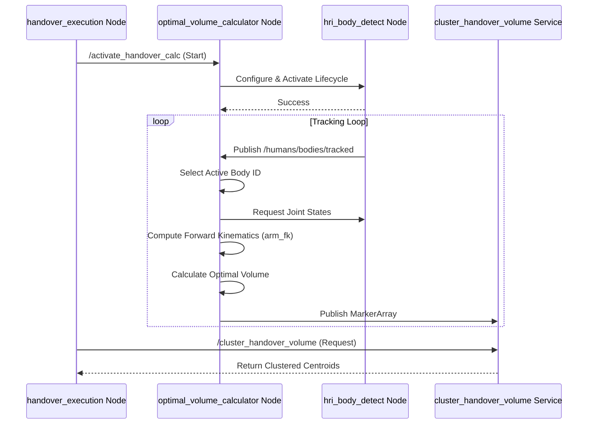
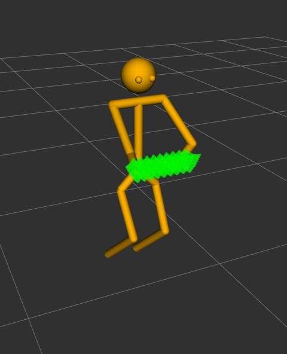

# Role in the TRL 6-7 Demonstrator

This module serves as the primary situational-awareness component for calculating handover points within the ARISE-KIRO Agile Assembly and Handover Demonstrator. In a TRL6-7 industrial workstation environment, it operates continuously during the active handover phase to ensure a safe, ergonomic, and seamless exchange of tools between human workers and the platform manipulator by translating raw visual skeleton data into optimal handover points for object transfer.

## 1 Structural Runtime Execution Flow
The diagram below illustrates the overall flow of actions and high-level states during the execution of the KIRO collaborative task. The `kiro_handover_calculaiton` is activated during the `deliver_tool` phase (indicated as step 5 in the diagram), specifically during `hand-off` operation to the human worker (as opposed to delivery to a workbench).

<table>
  <tr>
    <td align="center"></td>
  </tr>
  <tr>
    <td align="center"><b>Figure 1:</b> Diagram of the robot’s workflow.</td>
  </tr>
</table>

### 1.2 System Architectural Diagram
The functional block diagram below maps the continuous runtime data flow across the primary system nodes, detailing specific ROS 2 topics and service request boundaries. This subsystem is fully active during the handover phase, mapping directly to the initial internal calculations after the **"Approach hand off position"** state shown in the workflow diagram above.

### 1.3 System Sequence Diagram
The following sequence diagram details the initialization and data processing flow when a handover is requested.

## 2 System Validation 

The `kiro_handover_calculation` framework was validated using a dual-stage testing pipeline: first under high-fidelity simulation using Gazebo environment to verify forward kinematics consistency and clustering convergence limits, and subsequently on physical hardware to establish real-world reliability.

After successfully installing and running this package (and its dependencies), the output in RViz will look like the following Figure.

<table>
  <tr>
    <td align="center"></td>
  </tr>
  <tr>
    <td align="center"><b>Figure 2:</b> Geometric visualization of the ergonomic workspace volume (green MarkerArray point cloud) and tracking coordinate frames inside RViz 2.</td>
  </tr>
</table>